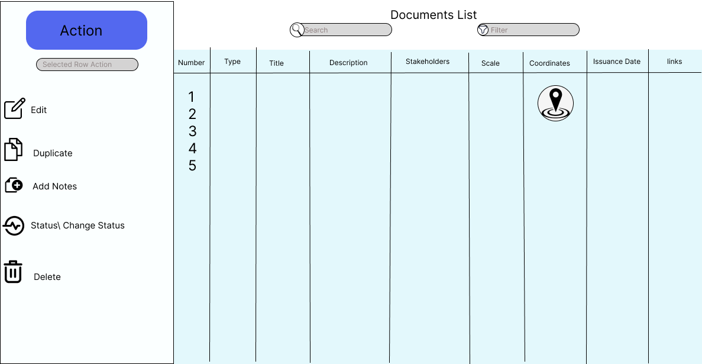
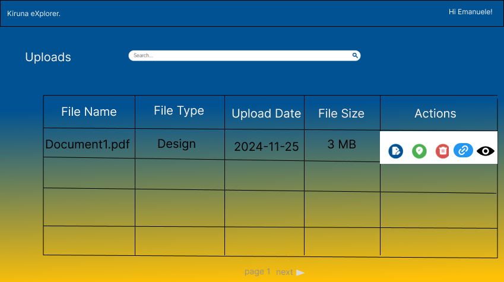

1.put the button for the coordinator part

2.put the search bar at the top of the website

3.put the map under the document list table (maybe it helps better)

4.put the filter for the icons that are shown in the document list

"UI Documentation for Handling Documents in the Same Spot"

Purpose:
This feature allows users to manage multiple documents efficiently in one location.

Document Count Icon:

1.Displays the number of documents stored.
Acts as a quick access point for managing documents.

2.User clicks the document count icon.
A sidebar appears, showing all documents with options to search and filter.
User manages documents directly from the sidebar.

Design Notes:
Keep the document count icon visible and intuitive.
Ensure the sidebar is non-intrusive and easy to navigate.
Use simple, minimalistic UI for a clean looks.

"UI Documentation for Uploads Page"

Overview:
The uploads page allows users to view and manage uploaded documents efficiently. It features a table displaying key file details and action icons for quick operations.

Table Details:
Column Description
File Name Name of the uploaded document.
File Type Indicates the type of file (e.g., PDF, Image).
Upload Date Date the file was uploaded.
File Size Size of the file in MB or GB.
Actions Quick access icons for managing documents.

Action Icons:
Icon Action Purpose
Edit Modify file details Opens a modal for editing information.
Location Locate file Navigates to the file's storage location.
Delete Remove file Prompts confirmation to delete a file.
Link open realted doc
View Preview file Opens a preview of the document.

Key Features:
Search Bar: Users can search for files by name.
Pagination: Navigates between pages of uploaded files.

Design Highlights:
Action Icons on Left: Easy access to frequently used actions.
Simple Table Layout: Organized and readable at a glance.
